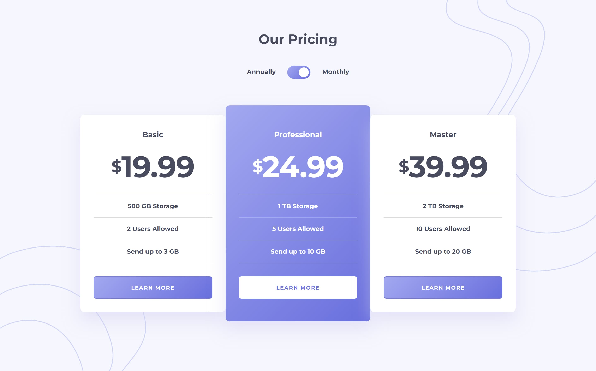
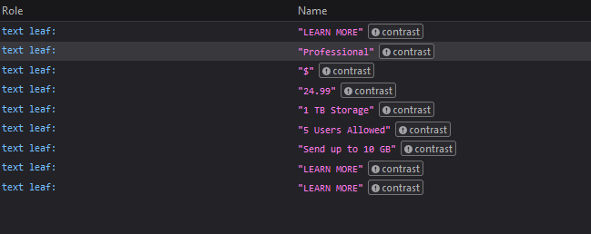

<picture>
  <source media="(prefers-color-scheme: dark)" srcset="./design/dark-banner.jpg">
  <source media="(prefers-color-scheme: light)" srcset="./design/light-banner.jpg">
  
</picture>

# Pricing Component with Toggle

I did this challenge to practice applying progressive enhancement by:

- Making sure the site is still working with:
  - HTML
  - HTML and CSS
  - HTML and JavaScript
- Making sure the site should be working with HTML, CSS, and JavaScript

Also, I want to practice using React. I think it would be better if I had done the challenge with the technologies that I usually use first. Then, I will be able to focus on the React instead of thinking about everything from scratch.

## The challenge

My challenge is to build out this pricing component and get it looking as close to the design as possible.

My users should be able to:

- View the optimal layout for the component depending on their device's screen size
- Control the toggle with both their mouse/trackpad and their keyboard
- View both prices without JavaScript
- **Bonus**: Complete the challenge with just HTML and CSS

## Explore this project

- [Pricing Component with Toggle | Frontend Mentor Challenge](https://sitepricingcomponent.netlify.app/)
- [HTML and CSS only Pricing Component with Toggle | Frontend Mentor Bonus Challenge](https://sitepricingcomponent.netlify.app/bonus)
- [Frontend Mentor solution page]()
- [Documentation](./docs/README.md)

## Screenshots



## Built with

- HTML
- [BEM (Block, Element, Modifier)](https://sparkbox.com/foundry/bem_by_example)
- [Sass](https://sass-lang.com/)
- JavaScript
- CSS Flexbox
- Progressive enhancement in mind
- Mobile-first workflow
- [scriptex/hover-media-query](https://github.com/scriptex/hover-media-query) - a progressively enhanced "hover" media query.

## What I learned

I learned quite a lot of things when building this project. I did not expect I would learn this much from a simple project.

## Progressively enhance the website

I tried to build the website progressively. It means the CSS and the JavaScript is only for enhancing the experience. Without those things, the site should be able to function. In short, the site will still make sense with just HTML.

Here are the four conditions that I tried to achieve:

| No  | Is the HTML available? | Is the CSS available? | Is the JavaScript available? | Does the content of the website can be understood? |
| --- | ---------------------- | --------------------- | ---------------------------- | -------------------------------------------------- |
| 1   | Yes                    | No                    | No                           | Yes                                                |
| 2   | Yes                    | Yes                   | No                           | Yes                                                |
| 3   | Yes                    | Yes                   | Yes                          | Yes                                                |
| 4   | Yes                    | No                    | Yes                          | Yes                                                |

The site will not work without the HTML obviously. But, as long as the HTML is available, I wanted the site still works and the content makes sense.

| Technologies              | The users will be able to                                                                |
|---------------------------|------------------------------------------------------------------------------------------|
| HTML                      | Understand the content                                                                   |
| HTML and CSS              | See good user interface and understand the content                                       |
| HTML, CSS, and JavaScript | See good user interface and get a toggle button to see the different types of the prices |
| HTML and JavaScript       | See radio buttons to toggle the view between the two different types of the prices       |

I used the "Web Developer" extension to disable or enable the JavaScript and CSS to see how my site will look without one of them.

[Web Developer - Chrome Web Store](https://chrome.google.com/webstore/detail/web-developer/bfbameneiokkgbdmiekhjnmfkcnldhhm)

## Toggle pricing

The toggle component was tricky to create. I created two versions of it. One is when the toggle functionality should work with JavaScript. The other version is when the toggle functionality works without JavaScript—the bonus challenge.

### Toggle pricing with JavaScript

I got the inspiration for the markup and some of the styling from the CodePen of Sara Soueidan.

The Pen — [Accessible Option(/Toggle) Switch](https://codepen.io/SaraSoueidan/pen/jpBbrq/)

The article — [On Designing and Building Toggle Switches](https://www.sarasoueidan.com/blog/toggle-switch-design/)

I created a Pen for my first experiment for creating the toggle component.

See the Pen — [Toggle Component](https://codepen.io/vanzasetia/pen/BaOwJjd)

Then, I started creating the toggle component for this challenge.

Now, I can not remember the whole process of how I created the toggle component. But, most of them are copy-pasting from the Pen that I created except for the sizes and other specific styles.

The caveat from this is that the toggle might not (fully) work as expected. As a user, I am expecting that I can click anywhere between the toggle component to toggle the price. But, now it only works if I:

- Click the labels,
- Click the opposite area of the circle, and
- Using arrow keys.

### Slightly better toggle pricing with JavaScript

I discovered a Pen by Scott O'Hara for a toggle component.

See the Pen — [Radio Toggle Switch](https://codepen.io/scottohara/pen/zLZwNv/)

His toggle component works even the users click the circle. This solved the problem that I don't have to click the opposite area of the circle.

The way it works is by making both `<label>` elements cover the toggle button. Then, lower the `z-index` for checked input. This makes the label of the unchecked radio input gets a higher `z-index`. The next time users click the toggle button, it will always check the unchecked radio input.

I would say that is smart.

Now, it's my turn to implement it.

Refactoring...

... done!

The toggle component has been updated. I can click on the circle and the toggle functionality will still work.

I created a Pen before I refactored my code.

See the Pen — [Better Toggle Component](https://codepen.io/vanzasetia/pen/poOVYKm/)

### Toggle pricing without JavaScript

At first, I tried to make the toggle component with radio buttons. I failed. Then, I remembered the checkbox input element. I tried using that element.

The HTML markup is much simpler than the toggle component with JavaScript. But, the accessibility of it is questionable.

The trickiest part is to ensure that the prices can be toggled with CSS.

For the toggle pricing with JavaScript, I can put it where ever I want. It does not depend on the markup. But, the toggle pricing without JavaScript depends on the markup.

It depends on it because I have to use a general sibling combinator (`~`). It means that if the checkbox is wrapped by a different parent element from the card container, then I can't target the price elements—that are inside the cards.

To make it clear, I give you an example. How do I make the `<p>` disappear with CSS when the checkbox is checked? Take a look at the following markup.

```html
<div class="toggle-component">
  <label for="pricing">Annually</label>
  <input
    type="checkbox"
    id="pricing"
    name="pricing"
  />
</div>
<div class="card">
  <p>I can't be targeted by the checkbox.</p>
</div>
```

It's impossible. There is no CSS combinator to jump above the parent element and then select the element inside another parent element.

Let's say the caret symbol is used for selecting the sibling of the parent element, then I can do the following:

```css
input[type="checkbox"]:checked ^ .card p {
  display: none;
}
```

In reality, there is no such thing. So, I have to make sure that the checkbox is wrapped with the same parent element of the card container.

With that said, there is still another problem. Since I can't wrap the checkbox with a `<div>` I can't position it properly together with the `<label>` element.

So, I have to use relative positioning with a magic number for the `left` property to horizontally centered the toggle component.

At small screen sizes, the toggle component will be outside the user's viewport width. I can fix it with media queries. But, I am not going to bother about it since this is just the bonus challenge. Just for fun.

I am interested in seeing how other people completed the challenge with HTML and CSS only. If there is someone who can create a robust solution, then I will update this section and improve my site.

## Color contrast

There is a color contrast issue with the original design. The labels for the toggle button which are "Annually" and "Monthly" texts don't have enough contrast.

I used the Chrome Developer tool to inspect the color of the original design. I got `#d5d6dd` as the color value.

As a side note, it is not the actual color code. The actual color code is `hsl(232, 13%, 49%)` and with `opacity: 50%`. So, the color code that I got was the result of the original color with reduced opacity.

I decided to test the contrast of the labels' original color (`#d5d6dd`) with the body's background color (`#f6f6fe`) using [Colorable](https://colorable.jxnblk.com/). The result is `Aa 1.35 Fail`. It has a very low contrast.

With that in mind, I decided to use the body's text color for those labels. This way, those labels have enough contrast. The result is `Aa 7.87 AAA` for the contrast between `#494c5f` (body's text color) and `#d5d6dd`.

Related resources for this section:

- [What's 'large text' in WCAG 2.0 parlance? - TPGi](https://www.tpgi.com/whats-large-text-in-wcag-2-0-parlance/)
- [Understanding Success Criterion 1.4.3: Contrast (Minimum) | WAI | W3C](https://www.w3.org/WAI/WCAG21/Understanding/contrast-minimum)

### More issues

I found more contrast issues after I tried running a contrast check on Firefox. The text inside the professional card and all the "learn more" buttons have not enough contrast.



I may try to fix the issue by changing the colors. But, that would make my site looks different from the original design. So, with making the objective—of making my site look as close as possible to the original design—in mind, I let these issues exist.

## About me

At Frontend Mentor, I have completed over 30 projects and written over 1500 code reviews. I am also one of the top 10 developers on the All Time Wall of Fame.

## Acknowledgements

Thanks to Sara Soueidan for putting her time and effort to write that blog post and create the Pen.

Thanks to Scott O'Hara for sharing his idea to create a toggle component.

## License

[MIT](./LICENSE)
